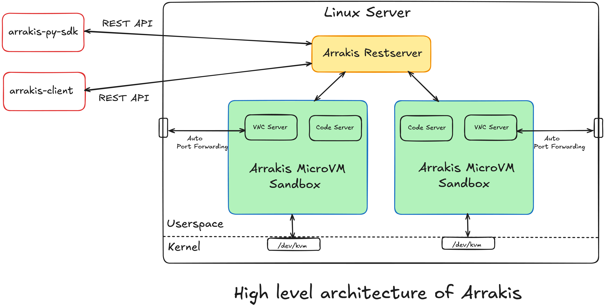

<p align="center">
  
</p>

# Arrakis

[](./LICENSE)

## Introduction ##

AI agents can generate malicious or buggy code that can attack the host system its run on. 

Many agents have elaborate multi-step plans to achieve their goals and benefit from the ability to backtrack to intermediate states.

**Arrakis** provides a **fully customizable** and **self-hosted** solution to spawn and manage Sandboxes for code execution and computer use. It has out-of-the box support for backtracking via **snapshot-and-restore**.

- Each sandbox runs Ubuntu inside with a code execution service and a VNC server running at boot.

- A REST API and a Python SDK let clients (both humans and AI Agents) programatically spawn sandboxes, upload files, a and execute code inside each sandbox.

- Automatically sets up and manages port forwarding from the self-hosted public server to the sanboxes running on it i.e. clients can easily access the sandbox GUI (including Chrome for computer use) without extra setup.

- Supports **snapshot-and-restore** out of the box i.e. AI Agents can do some work, snapshot a sandbox, and later backtrack to the exact previous state by restoring the snapshot. This means any processes spawned, files modified etc. will be restored as is inside the sandbox.Useful for Monte Carlo Tree Search based agents or explainability of elaborate agent execution flows.

- Secure by design, each sandbox [runs in a MicroVM](#architecture-and-features).

---

## Table of Contents

- [Introduction](#introduction)
- [Architecture And Features](#architecture-and-features)
- [Prerequisites](#prerequisites)
- [Installation](#installation)
- [Build](#build)
- [Build a custom rootfs for the guest](#build-a-custom-rootfs-for-the-guest)
- [Configuration](#configuration)
- [Usage](#usage)
- [Ongoing Work](#ongoing-work)
- [Contribution](#contribution)
  - [How to Contribute](#how-to-contribute)
    - [Reporting Bugs](#reporting-bugs)
    - [Suggesting Features](#suggesting-features)
    - [Pull Requests](#pull-requests)
- [License](#license)

___

## Architecture And Features



`arrakis` includes the following services and features

- **REST API**
  - **arrakis-restserver**
    - A daemon that exposes a REST API to *start*, *stop*, *destroy*, *list-all* VMs. Every VM started is managed by this server i.e. the lifetime of each VM is tied to the lifetime of this daemon.
    - The api is present at [api/server-api.yaml](./api/server-api.yaml).
    - [Code](./cmd/restserver)
  - **arrakis-client**
    - A Golang CLI that you can use to interact with **arrakis-restserver** to spawn and manage VMs.
    - [Code](./cmd/client)

- **Python SDK**
  - Completed, todo on official shipping and linking here.

- **Security**
  - Each sandbox runs in a MicroVM.
    - MicroVMs are lightweight Virtual Machines (compared to traditional VMs) powered by Rust based Virtual Machine Managers such as [firecracker](https://github.com/firecracker-microvm/firecracker) and [cloud-hypervisor](https://github.com/cloud-hypervisor/cloud-hypervisor).
    - **Arrakis** uses [cloud-hypervisor](https://github.com/cloud-hypervisor/cloud-hypervisor) as the VMM.
  - Any untrusted code executed within the sandbox is isolated from the host machine as well as other agents.
  - We use overlayfs to also protect the root filesystem of each sandbox.

- **Customization**
  - Dockerfile based rootfs customization.
    - Easily add packages and binaries to your VM's rootfs by manipulating a [Dockerfile](./resources/scripts/rootfs/Dockerfile).
  - Out of the box networking setup for the guest.
    - Each sandbox gets a tap device that gets added to a Linux bridge on the host.
    - ssh access to the sandbox.
  - Prebuilt Linux kernel for the sandbox
    - Or pass your own kernel to **arrakis-client** while starting VMs.

---

## Prerequisites

- `cloud-hypervisor` only works with `/dev/kvm` for virtualization on Linux machines. Hence, we only support Linux machines.
- The [cloud-hypervisor](https://github.com/cloud-hypervisor/cloud-hypervisor) binary installed on the host. More on this in the [Configuration](#Configuration) section.
- Any recent host (machine you'll run the **arrakis-restserver** on) Linux kernel >= 2.6.
- Check if virtualization is enabled on the host by running. 
    ```bash
    stat /dev/kvm
    ```
- [Golang >= 1.23](https://go.dev/) installed on the host machine.

---

## Installation

- Install Golang dependencies using -
    ```bash
    go mod tidy
    ```

- The easiest way to install prerequisite images is to use the `install-images.py` script.
    ```bash
    ./install-images.py
    ```

- The following images are installed by the script above and can also be installed manually -
  
  - Install the [cloud-hypervisor](https://github.com/cloud-hypervisor/cloud-hypervisor) binary and note down the path of the binary. This will be used in the [Configuration](#configuration) section. By default we look for this binary at `resources/bin/cloud-hypervisor`, you may place it there.

  - Download the prebuilt guest kernel for the VM from [arrakis-images](https://github.com/abshkbh/arrakis-images/blob/main/guest/kernel/vmlinux.bin), note down the path. This will be used in the [Configuration](#configuration) section. By default we look for this binary at `resources/bin/vmlinux.bin`, you may place it there.

---

## Build

- Make everything. You"ll be prompted by `sudo` once while making the guest rootfs.
    ```bash
    make all
    ```
  All binaries will be placed in `./out`.

- The following binaries are built -
  - **arrakis-restserver** - A daemon exposing a REST API to create, manage and interact with cloud-hypervisor based MicroVMs.
  - **arrakis-client** - A CLI client to communicate with **arrakis-restserver**.
  - **arrakis-cmdserver** - A daemon to execute shell commands that can be put inside the guest using the [Dockerfile](./resources/scripts/rootfs/Dockerfile) and **arrakis-rootfsmaker**.
  - **arrakis-codeserver** - A daemon to run **python** or **typescript** node that can be put inside the guest using the `Dockerfile` and **arrakis-rootfsmaker**.
  - **arrakis-guestinit** - The init running inside the MicroVM guest.
  - **arrakis-guestrootfs-ext4.img** - The rootfs used for the MicroVM guest.
  - **arrakis-rootfsmaker** - The program used to convert the [Dockerfile](./resources/scripts/rootfs/Dockerfile) into the guest rootfs (**arrakis-guestrootfs-ext4.img**).
  - `gen` - Contains the generated code for both the [cloud-hypervisor API](./api/arrakis-api.yaml) (used by **arrakis-restserver**) and [REST server API](./api/server-api.yaml) (used by **arrakis-client**).  

- Clean all binaries.
    ```bash
    make clean
    ```

---

## Build a custom rootfs for the guest

- The rootfs for guests can be configured using the provided [Dockerfile](./resources/scripts/rootfs/Dockerfile).

  - An example of how custom binaries can be added to the rootfs can be found [here](./resources/scripts/rootfs/Dockerfile#L66).
    - By default we keep custom binaries at `/opt/custom_scripts/` within the guest.  

- Command to make the guest rootfs -
  ```bash
  make guestrootfs
  ```

---

## Configuration

- A [config.yaml](./config.yaml) file is used to configure all the services provided by this project. It has defaults but could be modified.

- Configuring services on the host -
  - Host services are configured under the `hostservices` section.

- Configuring **arrakis-restserver** -
  - The `hostservices` -> `restserver` sub-section is used.
  - **state_dir** - Where each MicroVM's runtime state is stored.
  - **chv_bin** - The path to the **cloud-hypervisor** binary on the host.
  - **kernel** - The path to the kernel to be used for all MicroVMs.
  - **rootfs** - The path to the rootfs to be used for all MicroVMs. Set to **./out/arrakis-guestrootfs-ext4.img** by default.

- Configuring **arrakis-client** -
  - The `hostservices` -> `client` sub-section is used.
  - **server_host** - The IP at which the **arrakis-restserver** running.
  - **server_port** - The port at which the **arrakis-restserver** is running.

- Configuring services inside the guest -
  - Guest services are configured under the `guestservices` section.
  - The sample config file has an example for an optional **codeserver** inside the guest.

---

## Usage

- Before anything we need our `arrakis-restserver` to start. Start it with -
  ```bash
  sudo ./out/arrakis-restserver
  ```
- Root access is only needed to configure **iptables** for guest networking. Removing the root dependency is being currently worked on.

- In a separate shell we will use the CLI client to create and manage VMs.

- Start a VM named `foo`. It returns metadata about the VM which could be used to interacting with the VM.
  ```bash
  ./out/arrakis-client start -n foo
  ```
  
  ```bash
  started VM: {"codeServerPort":"","ip":"10.20.1.2/24","status":"RUNNING","tapDeviceName":"tap-foo","vmName":"foo"}
  ```

- SSH into the VM.
  - ssh credentials are configured [here](./resources/scripts/rootfs/Dockerfile#L6).
  ```bash
  # Use the IP returned. Password is "elara0000"
  ssh elara@10.20.1.2
  ```

- Inspecting a VM named `foo`.
  ```bash
  ./out/arrakis-client list -n foo
  ```

  ```bash
  VM: {"ip":"10.20.1.2/24","status":"RUNNING","tapDeviceName":"tap-foo","vmName":"foo"}
  ```

- List all the VMs.
  ```bash
  ./out/arrakis-client list-all
  ```

  ```bash
  VMs: {"vms":[{"ip":"10.20.1.2/24","status":"RUNNING","tapDeviceName":"tap-foo","vmName":"foo"}]}
  ```

- Stop the VM.
  ```bash
  ./out/arrakis-client stop -n foo
  ```

- Destroy the VM.
  ```bash
  ./out/arrakis-client destroy -n foo
  ```

- Snapshotting and Restoring the VM.
  - We support snapshotting the VM and then using the snapshot to restore the VM. Currently, we restore the VM to use the same IP as the original VM. If you plan to restore the VM on the same host then either stop or destroy the original VM before restoring. In the future this won't be a constraint.
  ```bash
  ./out/arrakis-client snapshot -n foo-original -o foo-snapshot
  ```

  ```bash
  ./out/arrakis-client destroy -n foo-original -o foo-snapshot
  ```

  ```bash
  ./out/arrakis-client restore -n foo-original --snapshot foo-snapshot
  ```

---

## Ongoing Work

- The current focus is on a Python SDK on top of the [REST API](./api/server-api.yaml).

- This SDK could be used to provide coding and general sandboxes to LLMs or AI Agents via tool use.

---

## Contribution

First off, thank you for considering contributing to **arrakis**! 🎉

### How to Contribute

#### Reporting Bugs

If you find a bug, please [open an issue](https://github.com/yourusername/arrakis/issues/new) and include:

- A clear description of the problem
- Steps to reproduce the issue
- Expected vs. actual behavior
- Any relevant logs or screenshots

#### Suggesting Features

Have an idea for a new feature? We'd love to hear it! Please [open an issue](https://github.com/yourusername/arrakis/issues/new) and provide:

- A clear description of the feature
- The motivation behind it
- Potential benefits

#### Pull Requests

1. **Fork the Repository**

2. **Create a Feature Branch**
    ```bash
    git checkout -b feature/your-feature-name
    ```

3. **Commit Your Changes**
    ```bash
    git commit -m "Add feature: your feature description"
    ```

4. **Push to Your Fork**
    ```bash
    git push origin feature/your-feature-name
    ```

5. **Open a Pull Request**

---

## License

This project is licensed under the [MIT License](./LICENSE).

---
