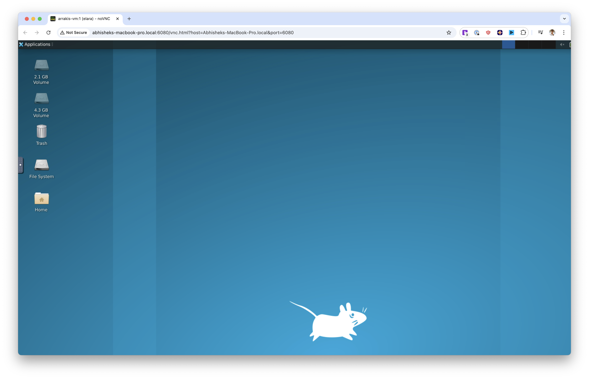

# Arrakis

[](./LICENSE)

## Introduction ##

AI agents can generate malicious or buggy code that can attack the host system its run on. 

Many agents have elaborate multi-step plans to achieve their goals and benefit from the ability to backtrack to intermediate states.

**Arrakis** provides a **secure**, **fully customizable**, and **self-hosted** solution to spawn and manage Sandboxes for code execution and computer use. It has out-of-the box support for backtracking via **snapshot-and-restore**.

- Secure by design, each sandbox [runs in a MicroVM](#architecture-and-features).

- Each sandbox runs Ubuntu inside with a code execution service and a VNC server running at boot.

- A REST API, Python SDK [py-arrakis](https://pypi.org/project/py-arrakis/), and a [MCP server](https://github.com/abshkbh/arrakis-mcp-server) let clients (both humans and AI Agents) programatically spawn sandboxes, upload files, and execute code inside each sandbox.

- Automatically sets up and manages port forwarding from the self-hosted public server to the sanboxes running on it i.e. clients can easily access the sandbox GUI (including Chrome for computer use) without extra setup.

- Supports **snapshot-and-restore** out of the box i.e. AI Agents can do some work, snapshot a sandbox, and later backtrack to the exact previous state by restoring the snapshot. This means any processes spawned, files modified etc. will be restored as is inside the sandbox.Useful for Monte Carlo Tree Search based agents or explainability of elaborate agent execution flows.

---

## Table of Contents

- [Introduction](#introduction)
- [Demo](#demo)
- [Setup](#setup)
  - [Prerequisites](#prerequisites)
  - [Quick setup using prebuilts](#quick-setup-using-prebuilts)
  - [Run the arrakis-restserver](#run-the-arrakis-restserver)
  - [Use the CLI or py-arrakis](#use-the-cli-or-py-arrakis)
- [Quickstart](#quickstart)
  - [SDK](#sdk)
  - [MCP](#mcp)
  - [GUI For Computer Use](#gui-for-computer-use)
  - [CLI Usage](#cli-usage)
- [Architecture And Features](#architecture-and-features)
- [Customization](#customization)
- [Contribution](#contribution)
  - [Legal Info](#legal-info)
    - [Contributor License Agreement](#contributor-license-agreement)
    - [License](#license)
- [License](#license)

___

## Demo

Watch Claude code a live Google docs clone using Arrakis via MCP. It even snapshots the sandbox to checkpoint progress.

[](https://www.youtube.com/watch?v=IZ5cAnhAdPQ)

---

## Setup

### Prerequisites

- `cloud-hypervisor` only works with `/dev/kvm` for virtualization on Linux machines. Hence, we only support Linux machines.

- Check if virtualization is enabled on the host by running. 
    ```bash
    stat /dev/kvm
    ```

### Quick setup using prebuilts

- You can leverage our setup.sh script and prebuilt binaries to easily set up Arrakis.
    ```bash
    curl -sSL https://raw.githubusercontent.com/abshkbh/arrakis/main/setup/setup.sh | bash
    ls arrakis-prebuilt
    ```

### Run the arrakis-restserver

- Now we have a folder with all binaries and images pulled. We always need to run `arrakis-restserver` first.
    ```bash
    cd arrakis-prebuilt
    sudo ./arrakis-restserver
    ```

### Use the CLI or py-arrakis

- You can use the CLI or [py-arrakis](https://pypi.org/project/py-arrakis/) to spawn and manage VMs.
    ```bash
    cd arrakis-prebuilt
    ./arrakis-client start -n agent-sandbox
    ```

---

## Quickstart

### SDK

Arrakis comes with a Python SDK [py-arrakis](https://pypi.org/project/py-arrakis/) that lets you spawn, manage, and interact with VMs seamlessly.

- Install the SDK
  ```bash
  pip install py-arrakis
  ```

- Follow the instructions in [Usage](#usage) to run the `arrakis-restserver` on a Linux machine, or download pre-built binaries from the [official releases page](https://github.com/abshkbh/arrakis/releases).

- Use py-arrakis to interact with `arrakis-restserver`.

- Run untrusted code
  ```python
  # Replace this with the ip:port where `arrakis-restserver` is running.
  sandbox_manager = SandboxManager('http://127.0.0.1:7000')

  # Start a new sandbox.
  with sb as sandbox_manager.start_sandbox('agent-sandbox'):
    sb.run_cmd('echo hello world')

  # Sandbox `sb` automatically destroyed when the context is exited.
  ```

- Snapshot and restore a sandbox
  ```python
  # Start a sandbox and write some data to a file.
  sandbox_name = 'agent-sandbox'
  sandbox = sandbox_manager.start_sandbox(sandbox_name)
  sandbox.run_cmd("echo 'test data before snapshot' > /tmp/testfile")
  snapshot_id = sandbox.snapshot("initial-state")
  sandbox.run_cmd("echo 'test data after snapshot' > /tmp/testfile")

  # Destroy the sandbox.
  sandbox.destroy()

  # Restore the sandbox from the snapshot and verify we have the same data at the time of the
  # snapshot.
  sandbox = sandbox_manager.restore(sandbox_name, snapshot_id)
  result = sandbox.run_cmd("cat /tmp/testfile")
  # result["output"] should be "test data before snapshot".
  ```

___

### MCP

- Arrakis also comes with a [MCP server](https://github.com/abshkbh/arrakis-mcp-server) that lets MCP clients like Claude Desktop App, Windsurf, Cursor etc.. spawn and manage sandboxes.

- Here is a sample `claude_desktop_config.json`
  ```json
  {
      "mcpServers": {
        "arrakis": {
            "command": "/Users/username/.local/bin/uv",
            "args": [
                "--directory",
                "/Users/username/Documents/projects/arrakis-mcp-server",
                "run",
                "arrakis_mcp_server.py"
            ]
        }
      }
  }
  ```

___

### GUI For Computer Use



- Every sandbox comes with a VNC server running at boot. It also comes with Chrome pre-installed.

- Arrakis also handles port forwarding to expose the VNC server via a port on the dev server running `arrakis-restserver`.

- Start a sandbox and get metadata about the sandbox including the VNC connection details.

  ```python
  # Replace this with the ip:port where `arrakis-restserver` is running.
  sandbox_manager = SandboxManager('http://127.0.0.1:7000')
  sb = sandbox_manager.start_sandbox('agent-sandbox')
  print(sb.info())
  ```

- We can get the VNC connection details from the `port_forwards` field in the response. The VNC server is represented by the description `gui` in a port forward entry. We will use the `host_port` field to connect to the VNC server.
  ```bash
  {
    'name': 'agent-sandbox',
    'status': 'RUNNING',
    'ip': '10.20.1.2/24',
    'tap_device_name': 'tap0',
    'port_forwards': [{'host_port': '3000', 'guest_port': '5901', 'description': 'gui'}]
  }
  ```

- Use any [VNC client](https://github.com/novnc/noVNC) to connect to the VNC server to access the GUI.
  ```bash
  # We see port 3000 is the host port forwarded to the VNC server running inside the sandbox.
  ./utils/novnc_proxy --vnc <dev-server-ip>:3000
  ```
___

### CLI Usage

- Arrakis comes with an out-of-the-box CLI client that you can use to spawn and manage VMs.

- Start **arrakis-restserver** as detailed in the [Setup](#setup) section.

- In a separate shell we will use the CLI client to create and manage VMs.

- Start a VM named `foo`. It returns metadata about the VM which could be used to interacting with the VM.
  ```bash
  ./out/arrakis-client start -n foo
  ```
  
  ```bash
  started VM: {"codeServerPort":"","ip":"10.20.1.2/24","status":"RUNNING","tapDeviceName":"tap-foo","vmName":"foo"}
  ```

- SSH into the VM.
  - ssh credentials are configured [here](./resources/scripts/rootfs/Dockerfile#L6).
  ```bash
  # Use the IP returned. Password is "elara0000"
  ssh elara@10.20.1.2
  ```

- Inspecting a VM named `foo`.
  ```bash
  ./out/arrakis-client list -n foo
  ```

  ```bash
  VM: {"ip":"10.20.1.2/24","status":"RUNNING","tapDeviceName":"tap-foo","vmName":"foo"}
  ```

- List all the VMs.
  ```bash
  ./out/arrakis-client list-all
  ```

  ```bash
  VMs: {"vms":[{"ip":"10.20.1.2/24","status":"RUNNING","tapDeviceName":"tap-foo","vmName":"foo"}]}
  ```

- Stop the VM.
  ```bash
  ./out/arrakis-client stop -n foo
  ```

- Destroy the VM.
  ```bash
  ./out/arrakis-client destroy -n foo
  ```

- Snapshotting and Restoring the VM.
  - We support snapshotting the VM and then using the snapshot to restore the VM. Currently, we restore the VM to use the same IP as the original VM. If you plan to restore the VM on the same host then either stop or destroy the original VM before restoring. In the future this won't be a constraint.
  ```bash
  ./out/arrakis-client snapshot -n foo-original -o foo-snapshot
  ```

  ```bash
  ./out/arrakis-client destroy -n foo-original -o foo-snapshot
  ```

  ```bash
  ./out/arrakis-client restore -n foo-original --snapshot foo-snapshot
  ```

---

## Architecture And Features


`arrakis` includes the following services and features

- **REST API**
  - **arrakis-restserver**
    - A daemon that exposes a REST API to *start*, *stop*, *destroy*, *list-all* VMs. Every VM started is managed by this server i.e. the lifetime of each VM is tied to the lifetime of this daemon.
    - The api is present at [api/server-api.yaml](./api/server-api.yaml).
    - [Code](./cmd/restserver)
  - **arrakis-client**
    - A Golang CLI that you can use to interact with **arrakis-restserver** to spawn and manage VMs.
    - [Code](./cmd/client)

- **Python SDK**
  - Checkout out the official Python SDK - [py-arrakis](https://pypi.org/project/py-arrakis/)

- **Security**
  - Each sandbox runs in a MicroVM.
    - MicroVMs are lightweight Virtual Machines (compared to traditional VMs) powered by Rust based Virtual Machine Managers such as [firecracker](https://github.com/firecracker-microvm/firecracker) and [cloud-hypervisor](https://github.com/cloud-hypervisor/cloud-hypervisor).
    - **Arrakis** uses [cloud-hypervisor](https://github.com/cloud-hypervisor/cloud-hypervisor) as the VMM.
  - Any untrusted code executed within the sandbox is isolated from the host machine as well as other agents.
  - We use overlayfs to also protect the root filesystem of each sandbox.

- **Customization**
  - Dockerfile based rootfs customization.
    - Easily add packages and binaries to your VM's rootfs by manipulating a [Dockerfile](./resources/scripts/rootfs/Dockerfile).
  - Out of the box networking setup for the guest.
    - Each sandbox gets a tap device that gets added to a Linux bridge on the host.
    - ssh access to the sandbox.
  - Prebuilt Linux kernel for the sandbox
    - Or pass your own kernel to **arrakis-client** while starting VMs.

---

## Customization

- [Detailed README](./docs/detailed-README.md) goes over how to customize the default packages and binaries running in a sandbox.

---

## Contribution

Thank you for considering contributing to **arrakis**! 🎉

Feel free to open a PR. A detailed contribution guide is going to be available soon.

## Legal Info

### Contributor License Agreement

In order for us to accept patches and other contributions from you, you need to adopt our Arrakis Contributor License Agreement (the "**CLA**"). Please drop a line at abshkbh@gmail.com to start this process.

Arrakis uses a tool called CLA Assistant to help us keep track of the CLA status of contributors. CLA Assistant will post a comment to your pull request indicating whether you have signed the CLA or not. If you have not signed the CLA, you will need to do so before we can accept your contribution. Signing the CLA would be one-time process, is valid for all future contributions to Arrakis, and can be done in under a minute by signing in with your GitHub account.


### License

By contributing to Arrakis, you agree that your contributions will be licensed under the [GNU Affero General Public License v3.0](LICENSE) and as commercial software.

---

## License

This project is licensed under the [GNU Affero General Public License v3.0](./LICENSE). For commercial licensing, please drop a line at abshkbh@gmail.com.

---
